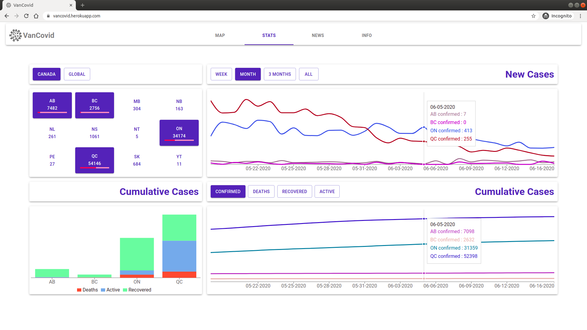
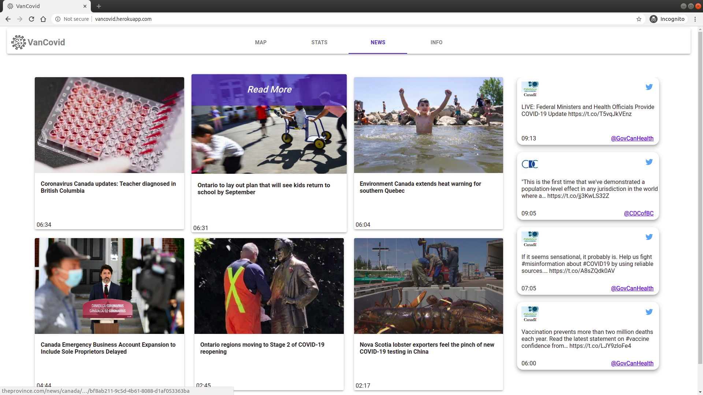
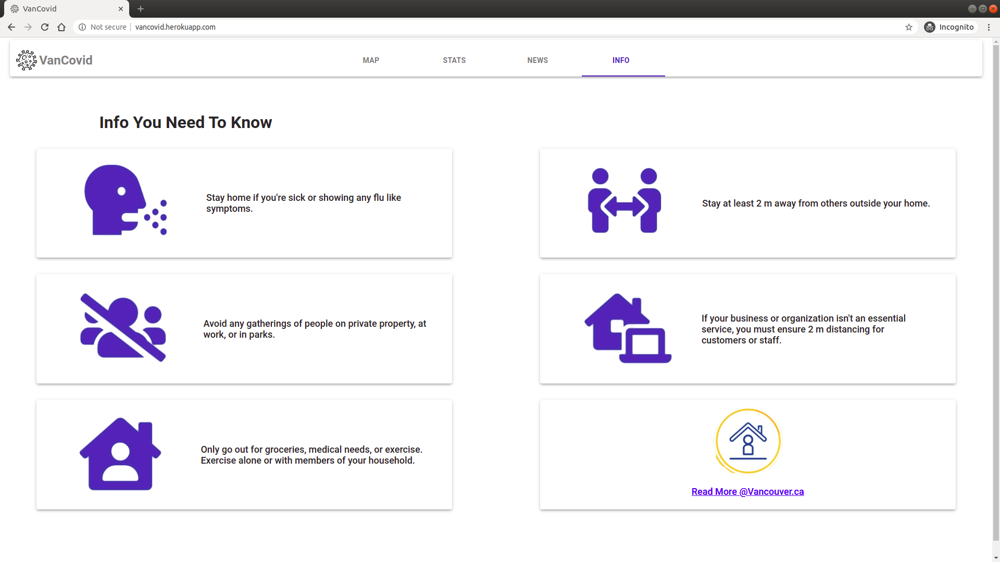

# VanCovid

This app was completed as a final project for the [Lighthouse Labs](https://www.lighthouselabs.ca/) Full Stack Web Development 12 week bootcamp.

As a group we were interested in exploring a variety of API’s and technologies in our final project. We decided to use React with Material UI on the front end and node with Express on the backend, using Postgres for our database.  The whole app is written in Typescript.  We also created some end to end tests with Cypress. Data prep for the stats page was done using Python with Pandas and NumPy.  The app is deployed to Heroku at [vancovid.herokuapp.com](https://vancovid.herokuapp.com)

The strange times we are in provided the inspiration for an application which would allow us to use these technologies.  We created VanCovid to act as a hub for Covid-19 related information for Vancouverites.  

Our idea came from the early days of the pandemic.  Remember the difficulty we all had finding toilet paper, hand sanitizer and masks? We also had a desire to know what was in the news and the latest statistics.   

This is the app we wished we had back then.

## Contributors
[Kurt Galvin](https://github.com/kurtgalvin), [Jessie Wright](https://github.com/jelywrig) and [Calvin Zheng](https://github.com/CalvinZheng1)

## Final Product

### Map
Our map page allows users to view and update stock levels of toilet paper, hand sanitizer and masks at various stores.  Users can also filter for stores with stock of a particular item.  The places search bar can be used to find a particular store.  If it is already in the database it will simply focus on that store, if it is not yet in the database it will be added with unknown stock levels.

***
### Stats
Our stats page displays Covid-19 case counts.  Users can toggle between Canada (with the ability to select provinces) and Global (with the ability to select countries).  Users can select a time period which will update both the new and cumulative case charts.  There is also the ability to toggle between confirmed (all) cases, recovered, active and deaths in order to dig further into the data.  All data was sourced from John Hopkins.  Hovering the chart will give a more granular view. We used the library ReCharts for the charting.

***

### News
Our news page enables users to view recent articles referencing Covid-19 from across Canada.  Each article can be opened in a new tab by clicking.  There is also a Twitter Feed on the right hand side.  It is filtered to only include tweets from trusted Canadian health sources (@GovCanHealth and @CDCofBC).  If a new tweet is sent by a trusted source it will appear without refreshing the page thanks to websockets.

***

### Info
Our info page contains basic tips and rules from the city of Vancouver to promote healthy practices. Mostly we included this to allow us to use some CSS animations.

***

## Challenges

#### Filtering Tweets
Figuring out how to prevent mentions and retweets from showing up in the feed took a bit of sleuthing around but it helped us become more familiar with the tweet json object.

#### API Limits
Both Twitter and the news API we used had limits on how often we could call them.  In order to address this we added caching on our backend, serving cached data and only calling out to the API to refresh the data every 15 minutes or more.

#### Deployment

Due our app being in Typescript plus our frontend being React there were a number of steps to the build process. This meant we had to customize our build and start scripts on Heroku in order to successfully deploy.  This was a great learning experience even if it was a bit "dev opsy".